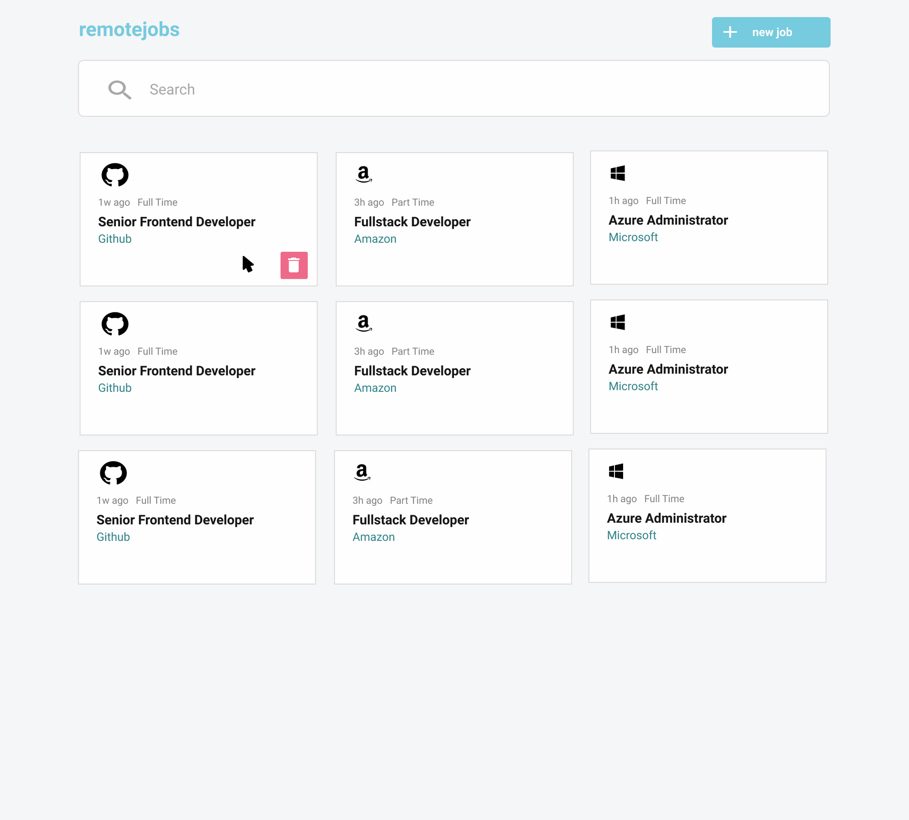

I used Angular 12 for front end and NodeJs with Rest API using local JSON file for backend.
Please run npm install after you clone my project.

# jobs-board
Create jobs board with CRUD functionality

Weava Coding Challenge - External

### Brief

Your challenge is to build out this jobs board/listing app using **Angular** as the javascript framework and use **Ngrx** as a state management library and use ngrx-effects for asynchronous code.

You can use any CSS framework for styling the app. Feel free to make your own design as long as the app is fully functional.

For data, feel free to choose between the following:

- local JSON file
- API server written in ExpressJs or Firebase (preferred)

If you want to take it up a notch, feel free to build this as a full-stack application!

### Objectives

- Able to add new job openings
- Able to delete jobs — note that the delete button should only appear when the user hovers the job
- Design the details page containing the full details for a job opening
- When a user clicks on any job, it redirects to the details page
- Allows editing of the job description on the details page
- Search between job listings
- Filter job by categories: company, job title, job type (part-time or full time)
- Add UI for the search filters — feel free how you want to design or where to put such filters

Optional:

- Add functionality to paginate job listings
- Add sorting functionality

